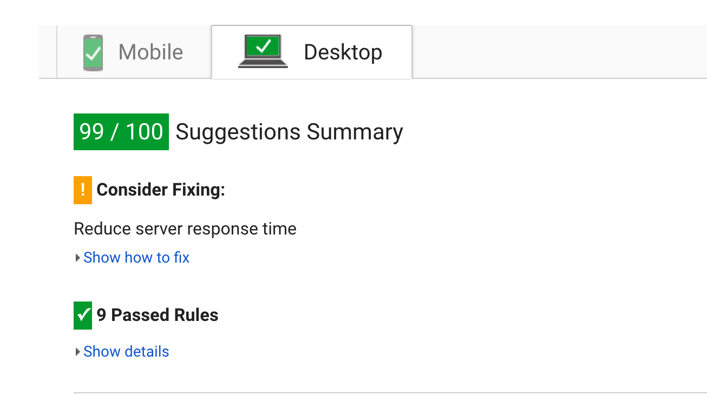

# Audit

Ik heb geprobeerd om de huidige bootstrap website zo snel mogelijk te maken. Hiervoor heb ik eerst gekeken naar de snelheid zoals die was. Dit kon nog aanzienlijk verbeterd worden! Hieronder heb ik gedocumenteerd wat ik veranderd heb. Ik heb dit een beetje met terug werkende kracht gedaan, want ik miste hier en daar een screenshot. In het vervolg doe ik dit preciezer!

Tested on:  2G connection (150ms, 450kb/s, 150kb/s)

## Before audit:

- Load:       23.36s
- Requests:   18

### After image optimization

- Load:       14.60s
- Requests:   18

### After minifing javascript

- Load: 6.72s
- Requests: 14

### After adding GZIP

- Load: 6.01s
- Requests: 14

### After minifing images (with tinyjpg/png)

- Load: 5.95s
- Requests: 14

Page insights: 71/100 mobile, 88/100 mobile

### After minifing css

- Load: 5.89s
- Requests: 14

### After adding critical css & loading scripts async (defer)

- Load: 5.6s
- Request: 13

### Page insights

Al met al is het een stuk sneller geworden! En de score op een goeie internet verbinding is 100/100. Alleen de server response time moet nog omhoog!

## Tools used

- Fontfaceobserver
- Gulp
- JS concat
- Gulp rename
- gulp-clean-css
- gulp-uglify
- critical css

