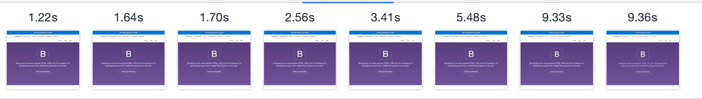
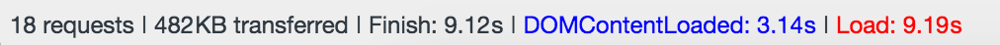

# Audit

Tested on:  2G connection (150ms, 450kb/s, 150kb/s)

## Before audit:

- Load:       23.36s
- Requests:   18

### After image optimization

- Load:       14.60s
- Requests:   18

### After adding GZIP

- Load:       9.19s
- Requests:   18

## To do

- Font
- reduce js files?

