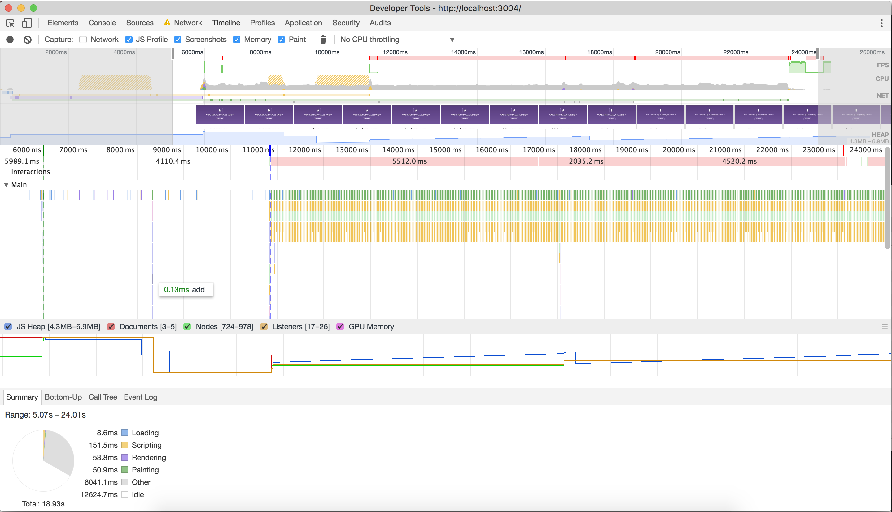

# Audit

Ik heb geprobeerd om de huidige bootstrap website zo snel mogelijk te maken.
Hiervoor heb ik eerst gekeken naar de snelheid zoals die was. Dit kon nog aanzienlijk verbeterd worden! Hieronder heb ik gedocumenteerd wat ik veranderd heb. Ik heb dit een beetje met terug werkende kracht gedaan, want ik  miste hier en daar een screenshot.
In het vervolg doe ik dit preciezer!

Kwa braching had het ook nog wel iets netter kunnen, ik heb nu een branch genaamt 'gulp', deze 
bevat dus een aantal optimalisaties die ook in een apparte branches hadden gekunt. 

Ik was eigenlijk van plan opnieuw begonnen, maar ik vond dat ik nu echt letterlijk dubbel werk aan het verrichten was.
In het vervolg ga ik dit beter bijhouden zodat het voor anderen beter inzichtelijk is
welke stappen ik genomen heb. 

## Before audit:
Tested on:  2G connection (150ms, 450kb/s, 150kb/s)

- Load:       23.36s
- Requests:   18

#Optimization

### After image optimization

Aanzienlijk versnelt scheelt bijna 8 seconden.

- Load:       14.60s
- Requests:   18

### After minifing javascript

Door het verminderen van de aantal aanvragen, is de snelheid omhoog gegaan. 
Iets verderop heb ik de jQuery en Bootstrap ingeladen via een CDN.

- Load: 6.72s
- Requests: 14

### After adding GZIP

Gzip is een methode om bestanden te verkleinen, zodat deze sneller via een netwerk kunnen worden verzonden.
(Zie [server.js](/sever.js))

- Load: 6.01s
- Requests: 14

### After minifing images, converting to WEBP with gulp (with tinyjpg/png)

- Load: 5.95s
- Requests: 14

Page insights: 71/100 mobile, 88/100 mobile

### After minifing css

- Load: 5.89s
- Requests: 14

### After adding critical css & loading scripts async (defer)

Om de gebruiker zo snel mogelijk opgemaakte content te laten zien, maak ik met behulp van een gulp-task
een critical.css bestand aan die ik vervolgens inline inlaad. Deze word dus inline ingeladen tijdens de eerste render.
 
 Ik denk dat de eerste render dus ook een stuk belangrijker is dan de totale laad tijd.
 
 Ook laad ik de Javascript Asynchroon (async) in waardoor er geen 'render-blocking' veroorzaakt word.
  
  [Rendering-blocking Javascript](https://github.com/user/repo/blob/branch/other_file.md) is dat er scripts worden geladen (ge-renderd) die de pagina
  ophouden, waardoor de pagina niet zo snel laad als hij eigenlijk zou kunnen. 
    

- Load: 5.6s
- Request: 13

### CDN's

Voor het inladen van jQuery en Bootstrap gaat via een [CDN](http://www.webopedia.com/TERM/C/CDN.html).

### Gulp

Gedurende het proces heb ik ook een gulp geimplementeerd. 

Hierbij gebruik ik de volgende node-modules:

- fs (The Node File System (fs) module)
- gulp-concat (voor het bundelen van js en css)
- gulp-rename (voor het hernoemen van files (bv. .css ---> .min.css))
- gulp-clean-css (voor het minifiën van CSS)
- gulp-critical (voor het creeren van critical CSS)
- gulp-imagemin (voor het converteren van .png/.jpg naar webp)

### Page insights

Al met al is het een stuk sneller geworden! En de score op een goeie internet verbinding (op school) is 100/100. Alleen de server response time moet nog omhoog!

## Tools used

- Fontfaceobserver
- Gulp
- JS concat
- Gulp rename
- gulp-clean-css
- gulp-uglify
- critical css

